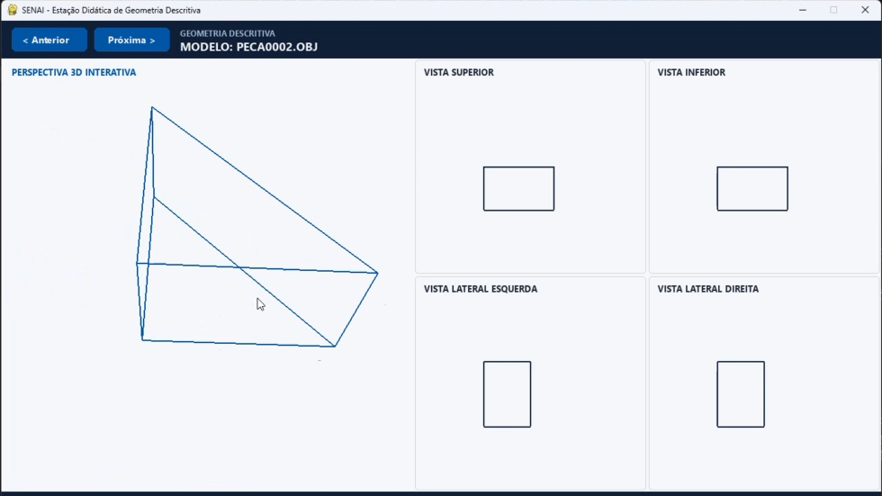

# Como a tecnologia 3D pode acelerar o aprendizado em Desenho Técnico no SENAI? 🛠️📐

Um dos maiores desafios dos alunos na Geometria Descritiva é a percepção espacial — a habilidade de converter um objeto tridimensional em vistas ortográficas 2D no papel (1º Diedro).

Para solucionar esse obstáculo, desenvolvi uma aplicação interativa utilizando Python, PyOpenGL e Pygame.

Principais recursos da ferramenta:
🔹 Visualização 3D Dinâmica: Rotação e zoom em tempo real com controle de mouse e atalhos.
🔹 Vistas Ortogonais Simultâneas: Exibição simultânea da Vista Superior, Inferior, Lateral Esquerda e Lateral Direita.
🔹 Leitura de Arquivos CAD (.OBJ): Capacidade de carregar peças customizadas para diferentes níveis de exercícios.
O resultado em sala de aula tem sido uma assimilação muito mais rápida dos conceitos de projeção e normas técnicas (ABNT).
O que acharam dessa abordagem didática? Como vocês aplicam tecnologia interativa no ensino técnico?

#DesenhoTécnico #SENAI #Python #OpenGL #EducacaoTecnologica #Engenharia #InovacaoNaEducacao

